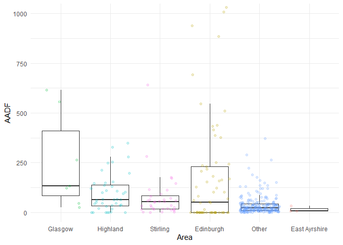
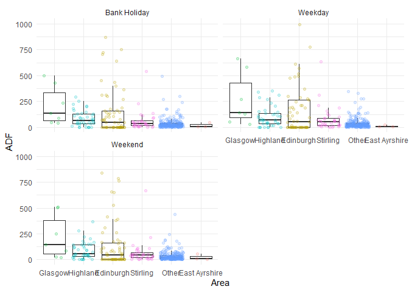

<!-- README.md is generated from README.Rmd. Please edit that file -->

# scottish-cycle-counts

<!-- badges: start -->
<!-- badges: end -->

The goal of scottish-cycle-counts is to read-in a process data on
cycling volumes in Scotland.

``` r
library(tidyverse)
```

The input dataset is a single .zip file:

``` r
zipped_data = list.files(pattern = "\\.zip$")
zipped_data
#> [1] "June 2022-June 2023.zip"
```

We can unzip it as follows:

``` r
unzip(zipped_data, exdir = "data-raw")
files_csv = list.files("data-raw", pattern = "\\.csv$", full.names = TRUE)
files_csv
#>  [1] "data-raw/Aberdeen City Council.csv"                            
#>  [2] "data-raw/Aberdeenshire Council.csv"                            
#>  [3] "data-raw/City of Edinburgh Council.csv"                        
#>  [4] "data-raw/Comhairle nan Eilean Siar (Western Isles Council).csv"
#>  [5] "data-raw/East Ayrshire Council.csv"                            
#>  [6] "data-raw/East Dunbartonshire Council.csv"                      
#>  [7] "data-raw/Glasgow City Council.csv"                             
#>  [8] "data-raw/John Muir Way.csv"                                    
#>  [9] "data-raw/National Cycle Nework (Scotland) - Sustrans.csv"      
#> [10] "data-raw/National Monitoring Framework - Cycling Scotland.csv" 
#> [11] "data-raw/North Ayrshire Council.csv"                           
#> [12] "data-raw/Perth and Kinross Council.csv"                        
#> [13] "data-raw/Scotland North East Trunk Roads.csv"                  
#> [14] "data-raw/Scotland North West Trunk Roads.csv"                  
#> [15] "data-raw/Scotland South East Trunk Roads.csv"                  
#> [16] "data-raw/Scotland South West Trunk Roads.csv"                  
#> [17] "data-raw/South Ayrshire Council.csv"                           
#> [18] "data-raw/South Lanarkshire Council.csv"                        
#> [19] "data-raw/Stirling Council.csv"                                 
#> [20] "data-raw/The Highland Council.csv"
```

We can read this file in R as follows:

``` r
# counts = arrow::open_dataset("data-raw")
# library(data.table)
# counts = data.frame(list_rbind(lapply(files_csv,data.table::fread))) #DT's quick way to read the files 
counts = map_dfr(files_csv, read_csv)
dim(counts)
#> [1] 230307     10
counts
#> # A tibble: 230,307 × 10
#>    area    count endTime             latitude location longitude provider siteID
#>    <chr>   <dbl> <dttm>                 <dbl> <chr>        <dbl> <chr>    <chr> 
#>  1 Aberde…    61 2023-06-14 00:00:00     57.1 A956 We…     -2.09 Aberdee… ABE65…
#>  2 Aberde…    26 2023-06-14 00:00:00     57.2 Dyce Dr…     -2.20 Aberdee… ABE918
#>  3 Aberde…    18 2023-06-14 00:00:00     57.2 Dyce Dr…     -2.22 Aberdee… ABE397
#>  4 Aberde…   158 2023-06-14 00:00:00     57.2 Ellon R…     -2.09 Aberdee… ABE920
#>  5 Aberde…   157 2023-06-14 00:00:00     57.1 Shell C…     -2.10 Aberdee… ABE229
#>  6 Aberde…   132 2023-06-14 00:00:00     57.2 Tillydr…     -2.11 Aberdee… ABE899
#>  7 Aberde…   395 2023-06-14 00:00:00     57.1 Deeside…     -2.10 Aberdee… ABE235
#>  8 Aberde…    20 2023-06-14 00:00:00     57.2 Farburn…     -2.17 Aberdee… ABE745
#>  9 Aberde…    91 2023-06-14 00:00:00     57.2 Parkway…     -2.10 Aberdee… ABE894
#> 10 Aberde…    39 2023-06-14 00:00:00     57.2 Site B …     -2.16 Aberdee… ABE288
#> # ℹ 230,297 more rows
#> # ℹ 2 more variables: startTime <dttm>, usmart_id <chr>
```

``` r
counts_monthly = counts |>
  mutate(
    year = year(endTime),
    month = month(endTime, label = TRUE),
    # date rounded to nearest month in 2020-01-01 format:
    date = lubridate::floor_date(endTime, unit = "month")
  ) |>
  group_by(date, area) |>
  summarise(
    count = sum(count)
  )
# Add column with names for most common areas:
# Most common areas are:
area_counts = counts_monthly |>
  group_by(area) |>
  summarise(
    count = sum(count)
  )

top_5_areas = area_counts |> 
  slice_max(count, n = 5)

# Add column that is area name if in top 5, else "Other":
counts_monthly_top = counts_monthly |>
  mutate(
    Area = ifelse(
      area %in% top_5_areas$area,
      area,
      "Other"
    )
  ) |>
  group_by(date, Area) |>
  summarise(
    count = sum(count)
  )
```

``` r
counts_monthly_top |>
  ggplot(aes(x = date, y = count, colour = Area)) +
  geom_line() +
  # Add log y-axis:
  scale_y_log10()
```

<!-- -->

A quick look at the data to check if there are sites with missing data
or duplicated records:

``` r
counts |>
  group_by(siteID,location) |> 
  unique() |> 
  count() |> 
  ggplot(aes(n))+geom_histogram(bins = 30)
```

<!-- -->

``` r
range(counts$startTime)
#> [1] "2022-06-01 UTC" "2023-06-13 UTC"
difftime(range(counts$startTime)[2],range(counts$startTime)[1],units = "days")
#> Time difference of 377 days
```

Each site should have a maximum of 378 days in the dataset. The
following code detects the sites with some type of duplication and the
ones with fewer records.

``` r
repeated_sites = counts |>
  group_by(siteID) |> 
  filter(n()>378) |> 
  select(siteID) |>
  unique()

repeated_sites$siteID  |> length()
#> [1] 22

fewer_sites = counts |>
  group_by(siteID) |> 
  filter(n()<300) |> 
  select(siteID) |>
  unique()

fewer_sites$siteID  |> length()
#> [1] 133
```

A subset of the clean sites is produced, so we can do some AADT
analysis. Records after 2023-06-01 are filtered out to have only one
year of data for each site

``` r

clean_counts = counts |>
  filter(startTime < as.Date("2023-06-01")) |> 
  anti_join(repeated_sites,by =join_by(siteID)) |>
  anti_join(fewer_sites,by =join_by(siteID)) |> 
  filter(n()==365,.by = siteID)

clean_counts |>
  group_by(siteID,location) |> 
  unique() |> 
  count() |> summary()
#>     siteID            location               n      
#>  Length:383         Length:383         Min.   :365  
#>  Class :character   Class :character   1st Qu.:365  
#>  Mode  :character   Mode  :character   Median :365  
#>                                        Mean   :365  
#>                                        3rd Qu.:365  
#>                                        Max.   :365
```

Here we calculate some statistics for the whole year including mean
(Averaage Annual Daily Flow), median daily flow, minimum and maximum
daily flows,

``` r
AADF_sites = clean_counts |> 
  summarise(across(count,list(mean = mean,
                              median = median,
                              min = min,
                              max = max)),.by = siteID)

AADF_sites
#> # A tibble: 383 × 5
#>    siteID  count_mean count_median count_min count_max
#>    <chr>        <dbl>        <dbl>     <dbl>     <dbl>
#>  1 ABE6535       19.9           18         1        50
#>  2 ABE896        44.1           43         0       195
#>  3 ABE6545       34.3           32         2        84
#>  4 ABE895        86.0           74         0       288
#>  5 ABE918        15.6           15         0        39
#>  6 ABE122        16.6           16         0        57
#>  7 ABE123        13.8           12         0        49
#>  8 ABE400        43.5           33         2       150
#>  9 ABE288        12.5            9         0        81
#> 10 ABE893        43.3           43         0        93
#> # ℹ 373 more rows
```

``` r
counts_per_area = counts |> select(siteID,area) |> unique()

AADF_sites |>
  left_join(counts_per_area,by = join_by(siteID)) |> 
  mutate(
    area = ifelse(
      area %in% top_5_areas$area,
      area,
      "Other"
    )) |> 
  ggplot(aes(x=fct_reorder(area,count_mean,.desc = T),
             y=count_mean))+
  geom_boxplot(outlier.shape = NA)+
  geom_jitter(aes(col = area),alpha = 0.2,shape = 19,show.legend = F)+
  coord_cartesian(ylim = c(0,1000))+
  theme_minimal()+
  labs(x = "Area",
       y = "AADF")
```

<!-- -->

We create a vector to store the bank holidays in Scotland extracted from
the [mygov.scot web](https://www.mygov.scot/scotland-bank-holidays)

``` r
scot_bank_holidays = as.Date(c("2022/06/03",
                               "2022/06/02",
                               "2022/08/1",
                               "2022/11/30",
                               "2022/12/25",
                               "2022/12/26",
                               "2022/12/27",
                               "2023/01/02",
                               "2023/01/03",
                               "2023/04/07",
                               "2023/05/01",
                               "2023/05/08",
                               "2023/05/29"))
```

We can calculate the same summary statistics by type of day: bank
holidays, weekends and weekdays (AAWDF).

``` r
ADF_dtype = clean_counts |> 
  mutate(d.type = case_when(as.Date(startTime) %in% scot_bank_holidays~"Bank Holiday",
                            wday(startTime,week_start = 1)<6~"Weekday",
                            TRUE~"Weekend")) |> 
  summarise(across(count,list(mean = mean,
                              median = median,
                              min = min,
                              max = max)),
            .by = c(siteID,d.type))

ADF_dtype
#> # A tibble: 1,149 × 6
#>    siteID  d.type  count_mean count_median count_min count_max
#>    <chr>   <chr>        <dbl>        <dbl>     <dbl>     <dbl>
#>  1 ABE6535 Weekday       23.6           22         6        50
#>  2 ABE896  Weekday       46.4           46         2       101
#>  3 ABE6545 Weekday       40.3           40         2        84
#>  4 ABE895  Weekday       78.1           65         1       247
#>  5 ABE918  Weekday       19.5           20         0        39
#>  6 ABE122  Weekday       17             16         0        50
#>  7 ABE123  Weekday       12.7           11         0        45
#>  8 ABE400  Weekday       40.1           31         2       110
#>  9 ABE288  Weekday       11.8            8         0        62
#> 10 ABE893  Weekday       52.6           52         6        93
#> # ℹ 1,139 more rows
```

``` r
counts_per_area = counts |> select(siteID,area) |> unique()

ADF_dtype |>
  left_join(counts_per_area,by = join_by(siteID)) |> 
  mutate(
    area = ifelse(
      area %in% top_5_areas$area,
      area,
      "Other"
    )) |> 
  ggplot(aes(x=fct_reorder(area,count_mean,.desc = T),
             y=count_mean))+
  geom_boxplot(outlier.shape = NA)+
  geom_jitter(aes(col = area),alpha = 0.2,shape = 19,show.legend = F)+
  coord_cartesian(ylim = c(0,1000))+
  facet_wrap(d.type~.,ncol = 2)+
  theme_minimal()+
  labs(x = "Area",
       y = "ADF")
```

<!-- -->

    #>   |                                                           |                                                   |   0%  |                                                           |.                                                  |   3%                     |                                                           |...                                                |   6% [unnamed-chunk-19]  |                                                           |....                                               |   8%                     |                                                           |......                                             |  11% [unnamed-chunk-20]  |                                                           |.......                                            |  14%                     |                                                           |........                                           |  17% [unnamed-chunk-21]  |                                                           |..........                                         |  19%                     |                                                           |...........                                        |  22% [unnamed-chunk-22]  |                                                           |.............                                      |  25%                     |                                                           |..............                                     |  28% [unnamed-chunk-23]  |                                                           |................                                   |  31%                     |                                                           |.................                                  |  33% [unnamed-chunk-24]  |                                                           |..................                                 |  36%                     |                                                           |....................                               |  39% [unnamed-chunk-25]  |                                                           |.....................                              |  42%                     |                                                           |.......................                            |  44% [unnamed-chunk-26]  |                                                           |........................                           |  47%                     |                                                           |..........................                         |  50% [unnamed-chunk-27]  |                                                           |...........................                        |  53%                     |                                                           |............................                       |  56% [unnamed-chunk-28]  |                                                           |..............................                     |  58%                     |                                                           |...............................                    |  61% [unnamed-chunk-29]  |                                                           |.................................                  |  64%                     |                                                           |..................................                 |  67% [unnamed-chunk-30]  |                                                           |...................................                |  69%                     |                                                           |.....................................              |  72% [unnamed-chunk-31]  |                                                           |......................................             |  75%                     |                                                           |........................................           |  78% [unnamed-chunk-32]  |                                                           |.........................................          |  81%                     |                                                           |..........................................         |  83% [unnamed-chunk-33]  |                                                           |............................................       |  86%                     |                                                           |.............................................      |  89% [unnamed-chunk-34]  |                                                           |...............................................    |  92%                     |                                                           |................................................   |  94% [unnamed-chunk-35]  |                                                           |.................................................. |  97%                     |                                                           |...................................................| 100% [unnamed-chunk-36]
    #> [1] "counts.R"
